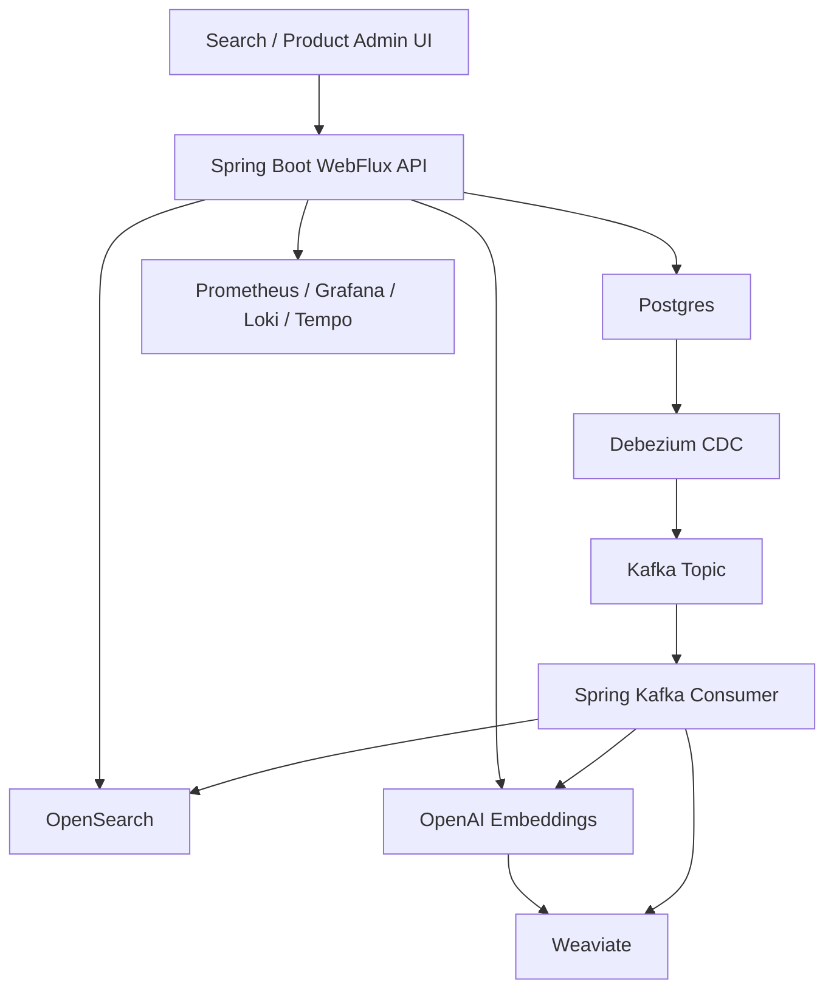

# Portfolio Case Study: AI Commerce Search Platform

## 30-Second Summary

I built a production-style ecommerce search platform that combines lexical search, semantic vector search, and CDC-based indexing. The system uses Spring Boot WebFlux, Postgres, Debezium, Kafka, OpenSearch, Weaviate, OpenAI embeddings, Flyway migrations, Docker, and an observability stack.

The project is designed to show backend/search platform skills for remote roles: API design, event-driven indexing, semantic search, production hardening, observability, and clear operational documentation.

## Problem

Basic keyword search often fails ecommerce intent. A shopper might type:

- `lap` and expect laptop products.
- `type-c` and expect chargers or power banks.
- `mobile charger` and expect phone chargers, charging stands, or portable power.

A production search backend needs more than CRUD and SQL queries. It needs lexical relevance, semantic retrieval, catalog synchronization, failure handling, and monitoring.

## Solution

The platform uses two search paths:

- **OpenSearch** for keyword, fuzzy, prefix, and product-name matching.
- **OpenAI embeddings + Weaviate** for semantic intent matching.

Product data starts in Postgres. Debezium captures product table changes, Kafka carries the change events, and a Spring Kafka consumer updates both OpenSearch and Weaviate.

## Architecture



## Engineering Highlights

- Built a reactive API using Spring WebFlux and R2DBC.
- Implemented product CRUD with validation and Postgres as source of truth.
- Combined OpenSearch lexical ranking with Weaviate semantic vector retrieval.
- Added ecommerce intent expansion for terms like `lap`, `type-c`, and `mobile charger`.
- Implemented Debezium/Kafka CDC indexing into search and vector stores.
- Added retry and DLQ handling for failed Kafka indexing events.
- Added Flyway migrations and production/local Spring profiles.
- Added a non-root Docker image and production runbook.
- Added observability through Actuator, Prometheus, Grafana, Loki, Tempo, and OpenTelemetry.

## Demo Queries

Use these examples in interviews or demos:

```bash
curl "http://localhost:8082/api/products/suggestions?q=lap&size=5"
curl "http://localhost:8082/api/products/suggestions?q=type-c&size=5"
curl "http://localhost:8082/api/products/search?q=mobile%20charger&page=0&size=10"
curl "http://localhost:8082/api/products/search/ai?q=type-c&page=0&size=10"
curl "http://localhost:8082/api/products/semantic-status"
```

Expected behavior:

- `lap` suggests `laptop` and related laptop terms.
- `type-c` maps to USB-C charger, phone charger, and power bank intent.
- `mobile charger` returns charger/power-related products when semantic indexing is ready.

## Production Thinking

The project includes production-grade runtime foundations while intentionally skipping CI/CD:

- Flyway schema migrations.
- Production profile with startup bootstrapping disabled.
- Kafka retry and DLQ.
- Docker image running as a non-root user.
- Health, metrics, logs, and traces.
- Production runbook in `deploy/PRODUCTION.md`.

## Resume Bullets

- Built an AI-powered ecommerce search platform combining OpenSearch lexical search with Weaviate vector search and OpenAI embeddings.
- Implemented Debezium/Kafka CDC indexing from Postgres into OpenSearch and Weaviate for near-real-time product search updates.
- Hardened the runtime with Flyway migrations, Kafka retry/DLQ handling, production Spring profiles, Docker non-root images, and observability.

## Tradeoffs And Next Improvements

- Add authentication and role-based access before exposing CRUD endpoints publicly.
- Add integration tests with Testcontainers for Postgres, Kafka, and OpenSearch.
- Add relevance scoring metadata to search responses so the UI can label each result as lexical, semantic, or merged.
- Add managed cloud deployment notes after choosing a target platform.
