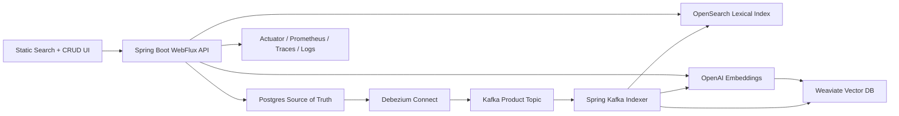

# AI Commerce Search Platform

Portfolio-grade ecommerce search platform built with Spring Boot WebFlux, OpenSearch lexical search, Weaviate vector search, OpenAI embeddings, and Debezium/Kafka CDC indexing.

This project demonstrates the kind of backend/search engineering expected in remote platform roles: source-of-truth data in Postgres, near-real-time CDC indexing, hybrid keyword + semantic search, production runtime hardening, and full local observability.

## Portfolio Highlights

- Hybrid search: OpenSearch keyword/fuzzy matching plus OpenAI-powered vector search.
- Ecommerce intent handling: queries like `lap`, `type-c`, and `mobile charger` map to relevant product categories.
- CDC indexing pipeline: Postgres changes stream through Debezium and Kafka into OpenSearch and Weaviate.
- Production-minded runtime: Flyway migrations, Spring profiles, Docker non-root image, Kafka retry/DLQ.
- Observability stack: Prometheus, Grafana, Loki, Tempo, Promtail, OpenTelemetry, and AI-specific search quality metrics.
- One-command local demo for reviewers and hiring teams.

## Architecture



## Case Study

See [PORTFOLIO.md](PORTFOLIO.md) for the engineering story, tradeoffs, and resume-ready talking points.

## Current Features

- Product CRUD API backed by Postgres/R2DBC
- Static product search page at `/index.html`
- Static product CRUD page at `/products.html`
- Random product cards on the home page
- Search products by keyword with pagination
- Autocomplete suggestions, limited to 5 results
- Lexical search through OpenSearch
- Semantic vector search through Weaviate
- OpenAI `text-embedding-3-small` embeddings
- Startup bootstrap from `src/main/resources/data/products.tsv`
- Automatic loading of 3000 product records only when the products table is empty
- Flyway database migrations
- Local and production Spring profiles
- Kafka retry and dead-letter topic support for failed indexing events
- Debezium Postgres CDC connector
- Kafka consumer that indexes product changes into OpenSearch and Weaviate
- AI observability for OpenAI token usage, model latency, retrieval quality, groundedness, hallucination proxy, and user feedback
- One-command local runner through `./run-app.sh`

## Use Cases

- Search ecommerce products by name or description
- Find products by user intent, for example searching `mobile` to find phone products
- Find related device categories, for example searching `laptop` to find MacBook, Dell XPS, HP Spectre, and similar products
- Show live autocomplete suggestions while users type
- Manage products from a browser CRUD page
- Keep search stores updated from product database changes
- Start the app and have Postgres, OpenSearch, and Weaviate become ready without manual seed/reindex calls

## Tech Stack

- Java 21
- Spring Boot 4.1
- Spring WebFlux
- Spring Kafka
- R2DBC Postgres
- OpenSearch
- Weaviate
- OpenAI embeddings API
- Kafka, Zookeeper, Debezium Connect
- Spring Actuator, Micrometer, OpenTelemetry
- Prometheus, Grafana, Loki, Promtail, Tempo, OpenTelemetry Collector
- Docker Compose
- Docker production image

## Services And Ports

| Service | Port | Purpose |
| --- | ---: | --- |
| Spring Boot app | `8082` | REST API and static pages |
| Postgres | `5432` | Product source database |
| OpenSearch | `9200` | Lexical product search |
| Kafka host listener | `9093` | App Kafka consumer connection |
| Kafka Connect | `8083` | Debezium connector API |
| Weaviate | `8085` | Vector database |
| Prometheus | `9090` | Metrics storage and query |
| Grafana | `3000` | Dashboards, logs, traces |
| Loki | `3100` | Log storage |
| Tempo | `3200` | Trace storage |
| OpenTelemetry Collector | `4317`, `4318` | OTLP trace receiver |

## API Endpoints

### Product CRUD

- `GET /api/products?page=0&size=10`
- `GET /api/products/{id}`
- `POST /api/products`
- `PUT /api/products/{id}`
- `DELETE /api/products/{id}`

Product JSON:

```json
{
  "id": 1,
  "name": "Apple iPhone 15",
  "description": "Smartphone product",
  "price": 999.99
}
```

### Search And Suggestions

- `GET /api/products/search?q=mobile&page=0&size=10`
- `GET /api/products/search/opensearch?q=mobile&page=0&size=10`
- `GET /api/products/search/ai?q=mobile&page=0&size=10`
- `GET /api/products/suggestions?q=mobile&size=5`

### AI Feedback

- `POST /api/products/ai/feedback`

Feedback JSON:

```json
{
  "query": "shoe",
  "mode": "ai",
  "productId": 3001,
  "relevant": true,
  "grounded": true,
  "rating": 5,
  "comment": "Returned the Nike runner product I expected."
}
```

Feedback is recorded as metrics and trace attributes. It is intended for search-quality monitoring, not long-term review storage.

### Bootstrap And Sync

- `POST /api/products/sync`
- `POST /api/products/reindex`
- `GET /api/products/semantic-status`

On startup, the app creates the `products` table if needed and checks whether it already has rows. If the table is empty, it reads `src/main/resources/data/products.tsv`, inserts 3000 products into Postgres, and waits for CDC indexing to populate OpenSearch and Weaviate. If products already exist, startup leaves the table untouched and skips the dataset load.

`/api/products/sync` and `/api/products/reindex` are still available as repair endpoints, but normal local startup does not require calling them manually.

## Run Locally After Clone

### Prerequisites

Install these first:

- Java 21
- Docker Desktop
- Git

The Maven wrapper is included, so a separate Maven install is not required.

### 1. Clone The Repository

```bash
git clone https://github.com/ponir-saha/search-engine.git
cd search-engine
```

### 2. Configure Environment

Create a local `.env` file:

```bash
cp .env.example .env
```

Edit `.env` and set your OpenAI key:

```bash
OPENAI_API_KEY=your-openai-api-key
```

`.env` is ignored by Git. Do not commit real API keys.

### 3. Start Everything

```bash
./run-app.sh
```

The script starts Docker services, waits for OpenSearch/Kafka Connect/Weaviate/observability tools, registers the Debezium connector if needed, and starts Spring Boot on port `8082`.

During Spring Boot startup, the application automatically:

1. Creates the Postgres `products` table if it does not exist.
2. Checks how many products already exist.
3. Skips dataset loading when existing products are found.
4. Loads 3000 products from `src/main/resources/data/products.tsv` only when the table is empty.
5. Waits until CDC/Kafka indexing catches OpenSearch and Weaviate up to the expected product count after a first-time load.

If port `8082` is already in use, stop the old Java process shown by the script and run it again.

### 4. Open The UI

- Search page: `http://127.0.0.1:8082/index.html`
- Product CRUD page: `http://127.0.0.1:8082/products.html`

### 5. Verify Semantic Search

```bash
curl "http://127.0.0.1:8082/api/products/semantic-status"
curl "http://127.0.0.1:8082/api/products/search?q=mobile&page=0&size=10"
curl "http://127.0.0.1:8082/api/products/search?q=laptop&page=0&size=10"
curl "http://127.0.0.1:8082/api/products/suggestions?q=mobile&size=5"
```

Check Weaviate product count:

```bash
curl -X POST "http://127.0.0.1:8085/v1/graphql" \
  -H "Content-Type: application/json" \
  -d '{"query":"{ Aggregate { Product { meta { count } } } }"}'
```

## Configuration

Important environment variables:

| Variable | Default | Purpose |
| --- | --- | --- |
| `OPENAI_API_KEY` | empty | OpenAI embeddings API key |
| `R2DBC_URL` | `r2dbc:postgresql://127.0.0.1:5432/products_db` | Postgres R2DBC URL |
| `POSTGRES_USER` | `pguser` | Postgres user |
| `POSTGRES_PASSWORD` | `pgpass` | Postgres password |
| `JDBC_URL` | `jdbc:postgresql://127.0.0.1:5432/products_db` | JDBC URL used by Flyway migrations |
| `FLYWAY_ENABLED` | `true` | Enables database migrations |
| `KAFKA_BOOTSTRAP_SERVERS` | `127.0.0.1:9093` | Kafka bootstrap server for the app |
| `OPENSEARCH_URL` | `http://127.0.0.1:9200` | OpenSearch URL |
| `OPENSEARCH_INDEX_PRODUCTS` | `products` | Product index name |
| `APP_KAFKA_TOPIC` | `dbserver1.public.products` | Debezium product topic |
| `APP_KAFKA_GROUP_ID` | `search-engine-group` | Kafka consumer group id |
| `APP_KAFKA_DLQ_TOPIC` | `dbserver1.public.products.dlq` | Dead-letter topic for failed CDC indexing events |
| `APP_KAFKA_CONCURRENCY` | `1` | Kafka listener concurrency |
| `APP_KAFKA_RETRY_MAX_ATTEMPTS` | `3` | Max attempts before DLQ |
| `APP_KAFKA_RETRY_INTERVAL_MS` | `2000` | Retry backoff interval |
| `APP_BOOTSTRAP_ENABLED` | `true` | Run startup product dataset bootstrap |
| `APP_BOOTSTRAP_DATASET` | `classpath:data/products.tsv` | Product dataset location |
| `APP_BOOTSTRAP_WAIT_FOR_INDEXES` | `true` | Wait for CDC indexing counts before startup finishes |
| `APP_BOOTSTRAP_WAIT_TIMEOUT` | `PT15M` | Max time to wait for OpenSearch/Weaviate counts |
| `VECTORDB_URL` | `http://127.0.0.1:8085` | Weaviate URL |
| `VECTORDB_TYPE` | `weaviate` | Vector database type |
| `OTEL_EXPORTER_OTLP_TRACES_ENDPOINT` | `http://127.0.0.1:4317` | OpenTelemetry trace export endpoint. The local app uses OTLP gRPC. |
| `OTEL_EXPORTER_OTLP_PROTOCOL` | `grpc` | OTLP protocol for local trace export |
| `MANAGEMENT_TRACING_SAMPLING_PROBABILITY` | `1.0` | Trace sample rate for local development |
| `LOG_FILE` | `logs/search-engine.log` | App log file tailed by Promtail |

## Production Deployment

Use [deploy/PRODUCTION.md](deploy/PRODUCTION.md) for production runtime guidance.

Key production defaults are in `src/main/resources/application-prod.yaml`:

- Startup dataset bootstrap is disabled.
- Actuator health details are hidden.
- Tracing samples at 10% by default.
- Product schema is managed with Flyway migrations.
- Kafka indexing failures retry and then publish to the configured DLQ.

## Observability

The local Docker Compose stack includes open-source observability tools:

- Spring Actuator exposes health, metrics, and Prometheus endpoints.
- Micrometer publishes JVM, HTTP, Reactor Netty, Kafka, and application metrics.
- Prometheus scrapes `http://host.docker.internal:8082/actuator/prometheus`.
- OpenTelemetry exports traces from the app to the collector.
- The OpenTelemetry Collector forwards traces to Tempo.
- Spring writes app logs to `logs/search-engine.log`.
- Promtail ships that log file to Loki.
- Grafana is provisioned with Prometheus, Loki, Tempo, and a `Search Engine Overview` dashboard.

Grafana is the main UI for observability. Prometheus, Loki, Tempo, and the OTLP collector are backend services; some of their root URLs may return readiness text, API JSON, `404`, or no browser-friendly page.

Open the tools:

| Tool | URL | Notes |
| --- | --- | --- |
| Grafana | `http://127.0.0.1:3000` | Login `admin` / `admin`; open Dashboards -> Search Engine -> Search Engine Overview |
| Search Dashboard | `http://127.0.0.1:3000/d/search-engine-overview/search-engine-overview` | Metrics, logs, and traces in one place |
| Prometheus | `http://127.0.0.1:9090` | Metrics backend. Use Grafana for the UI when this URL is not reachable from Docker Desktop |
| Loki | `http://127.0.0.1:3100/ready` | Log backend readiness. Use Grafana for the log UI. |
| Tempo | `http://127.0.0.1:3200/ready` | Trace backend readiness. Use Grafana for the trace UI. |
| OTLP HTTP receiver | `http://127.0.0.1:4318` | Ingest API only; a `404` at `/` is normal. |
| Actuator Health | `http://127.0.0.1:8082/actuator/health` | App health |
| Actuator Metrics | `http://127.0.0.1:8082/actuator/prometheus` | Prometheus scrape endpoint |

Useful Grafana queries:

Prometheus:

```promql
up{job="search-engine"}
sum(rate(http_server_requests_seconds_count{job="search-engine"}[1m]))
sum(jvm_memory_used_bytes{job="search-engine"}) by (area)
sum(rate(ai_openai_tokens_total{type="total"}[1m])) * 60
histogram_quantile(0.95, sum(rate(ai_openai_latency_seconds_bucket[5m])) by (le, model, operation))
histogram_quantile(0.95, sum(rate(ai_search_latency_seconds_bucket[5m])) by (le, mode))
avg(rate(ai_retrieval_groundedness_score_sum[5m]) / rate(ai_retrieval_groundedness_score_count[5m]))
avg(rate(ai_hallucination_rate_sum[5m]) / rate(ai_hallucination_rate_count[5m]))
avg(rate(ai_answer_quality_score_sum[5m]) / rate(ai_answer_quality_score_count[5m]))
avg(rate(ai_feedback_rating_sum[5m]) / rate(ai_feedback_rating_count[5m]))
```

Loki:

```logql
{job="search-engine"}
```

Tempo:

```text
Search service name: search-engine
```

Generate traffic to see metrics, logs, and traces:

```bash
curl "http://127.0.0.1:8082/api/products?page=0&size=5"
curl "http://127.0.0.1:8082/api/products/search?q=mobile&page=0&size=10"
curl "http://127.0.0.1:8082/api/products/search/ai?q=shoe&page=0&size=5"
curl "http://127.0.0.1:8082/api/products/suggestions?q=shoe&size=5"
curl "http://127.0.0.1:8082/api/products/semantic-status"
curl -X POST "http://127.0.0.1:8082/api/products/ai/feedback" \
  -H "Content-Type: application/json" \
  -d '{"query":"shoe","mode":"ai","productId":3001,"relevant":true,"grounded":true,"rating":5}'
```

AI-specific dashboard panels are included in `Search Engine Overview`:

- OpenAI token consumption per minute
- OpenAI embedding latency p95
- AI search latency p95
- AI search request rate
- Retrieval groundedness score
- Query coverage score
- Hallucination proxy rate
- Composite answer quality score
- User feedback rating

If you see `415 Unsupported Media Type` from `http://127.0.0.1:4318/v1/traces`, the app is sending OTLP gRPC traffic to the OTLP HTTP endpoint. Use the local default `OTEL_EXPORTER_OTLP_TRACES_ENDPOINT=http://127.0.0.1:4317`, or set `OTEL_EXPORTER_OTLP_PROTOCOL=http/protobuf` when intentionally sending to `4318/v1/traces`.

## CDC Flow

1. Product changes are written to Postgres.
2. Debezium Connect streams changes from `public.products`.
3. Events are published to Kafka topic `dbserver1.public.products`.
4. The Spring Kafka consumer receives product events.
5. The app indexes product data into OpenSearch.
6. The app generates OpenAI embeddings and upserts vectors into Weaviate.

## Manual Useful Commands

Check app status:

```bash
curl "http://127.0.0.1:8082/api/products/semantic-status"
```

Register or inspect Debezium connector:

```bash
curl "http://127.0.0.1:8083/connectors"
curl "http://127.0.0.1:8083/connectors/products-connector/status"
```

Check OpenSearch count:

```bash
curl "http://127.0.0.1:9200/products/_count"
```

Check Weaviate count:

```bash
curl -X POST "http://127.0.0.1:8085/v1/graphql" \
  -H "Content-Type: application/json" \
  -d '{"query":"{ Aggregate { Product { meta { count } } } }"}'
```

Run tests:

```bash
./mvnw test
```
